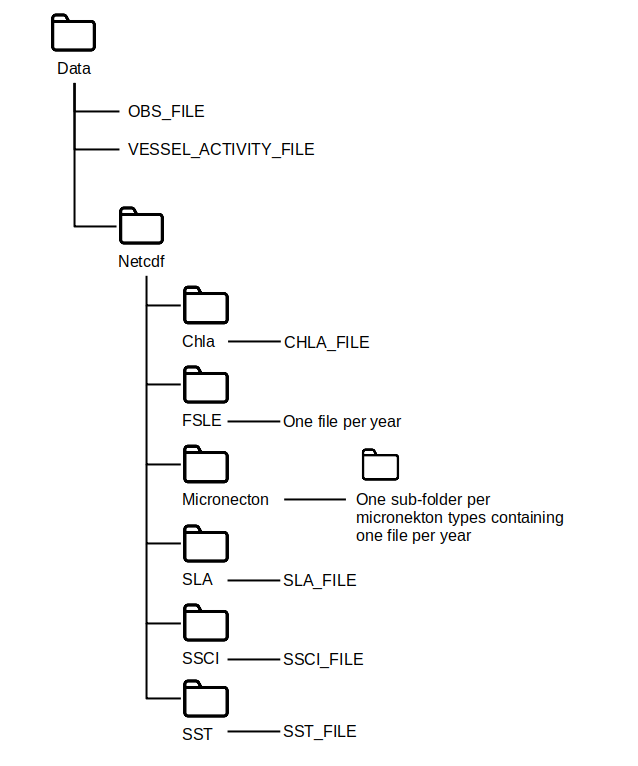

# Questioning the validity of the indicator-log hypothesis for tropical tuna

These are the scripts which were used to generate the results presented in the following study:

Guibert J., Dupaix A., Lengaigne M. & Capello M. (in revision) Questioning the validity of the indicator-log hypothesis for tropical tuna in the Western Indian Ocean. _Marine Ecology Progress Series_

Figures and statistical analyses of the study are available in the `Figure_and_stats` folder: `Plots_Github.Rmd` and `Statistical_analyses_Github.Rmd` generates the figures and the statistical tests respectively, of the main study and the supplementary materials.

## To launch the scripts

Prepare a config file using the template provided in `config/config_ex.R` :

  - if the raw datasets are not available, set `READ_DATA = F`. The scripts will then only run from the aggregated datasets provided in the output folder specified in `PATH_OUTPUT` in the config file and which are generated by scripts 1 to 7. Note that aggregated datasets provided as csv files were uploaded using `Git LFS`. It needs to be [installed](https://docs.github.com/en/repositories/working-with-files/managing-large-files/installing-git-large-file-storage) when cloning the repository.
  - if the raw datasets are available, they should be stored in a `Data` folder, with the subfolder structure presented in the image bellow.
  
Launch the new config file

## Config used in the study

The scripts were run twice: once with NLOG abundance index from observers data (`config_obs.R`) and once with the NLOG abundance index from Lagrangian simulations (`config_sim.R`).

## Data organization
  
  
  
